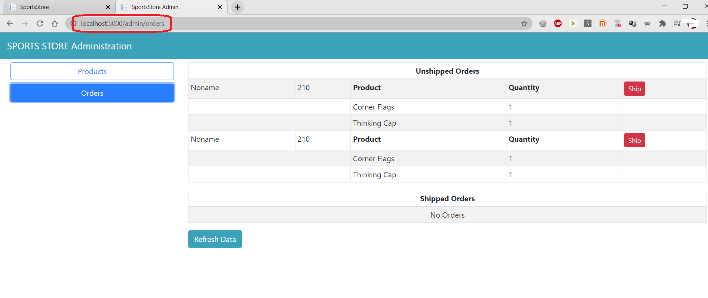
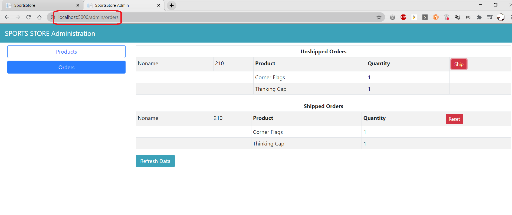
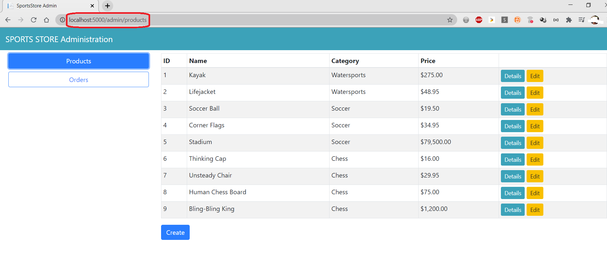
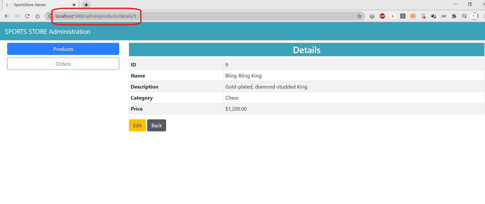
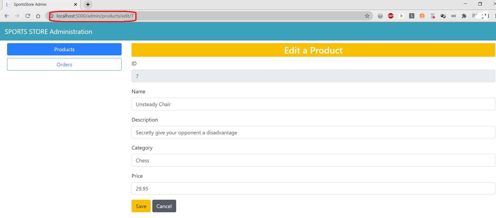
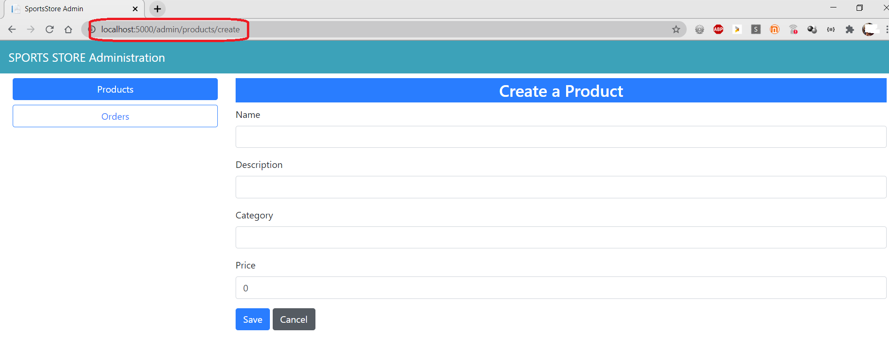

#  Creating "Sports Store" Application. Part 4

**[Blazor](https://dotnet.microsoft.com/apps/aspnet/web-apps/blazor) for creation administration features will be used**

## Description

- [Preparing Blazor Server](#preparing-blazor-server) 
- [Managing Orders](#managing-orders)
- [Managing Products](#managing-products)

## TODO

### Preparing Blazor Server

- Use [SportsStore ASP.NET Core MVC Application. Part 3](https://gitlab.com/autocode-aspnet-coretasks/sports-store-app-3.git)

- To create the services that Blazor uses add a `AddServerSideBlazor` method to the `ConfigureServices` method

        public void ConfigureServices(IServiceCollection services) 
        {
            ...
            services.AddServerSideBlazor();
        }

- To register the Blazor middleware components add a `MapBlazorHub` method. The final addition is to finesse the routing system to ensure that Blazor works seamlessly with the rest of the application

        public void Configure(IApplicationBuilder app, IWebHostEnvironment env) 
        {
            ...
            app.UseEndpoints(endpoints => 
            {
                endpoints.MapControllerRoute("catpage",
                    "{category}/Page{productPage:int}",
                    new { Controller = "Home", action = "Index" });
                endpoints.MapControllerRoute("page", "Page{productPage:int}",
                    new { Controller = "Home", action = "Index", productPage = 1 });
                endpoints.MapControllerRoute("category", "{category}",
                    new { Controller = "Home", action = "Index", productPage = 1 });
                endpoints.MapControllerRoute("pagination",
                    "Products/Page{productPage}",
                    new { Controller = "Home", action = "Index", productPage = 1 });
                endpoints.MapDefaultControllerRoute();
                endpoints.MapRazorPages();
                endpoints.MapBlazorHub();
                endpoints.MapFallbackToPage("/admin/{*catchall}", "/Admin/Index");
            });

            SeedData.EnsurePopulated(app);
        }

- Create the `Pages` folder and add to it a file named `_ViewImports.cshtml` 

        @namespace SportsStore.Pages
        @using Microsoft.AspNetCore.Mvc.RazorPages
        @addTagHelper *, Microsoft.AspNetCore.Mvc.TagHelpers

- Create the `Pages/Admin` folder and add to it a file named `_Imports.razor`, because Blazor requires its own imports file to specify the namespaces that it uses. 

        @using Microsoft.AspNetCore.Components
        @using Microsoft.AspNetCore.Components.Forms
        @using Microsoft.AspNetCore.Components.Routing
        @using Microsoft.AspNetCore.Components.Web
        @using Microsoft.EntityFrameworkCore
        @using SportsStore.Models

- Add a Razor Page named `Index.cshtml` to the `Pages/Admin` folder

        @page "/admin"

        @{
            Layout = null;
        }

        <!DOCTYPE html>
        <html>
        <head>
            <title>SportsStore Admin</title>
            <link href="/lib/twitter-bootstrap/css/bootstrap.min.css" rel="stylesheet"/>
            <base href="/"/>
        </head>
        <body>
        <component type="typeof(Routed)" render-mode="Server"/>
        
        </body>
        </html>

- Add a Razor Component named `Routed.razor` to the `Pages/Admin` folder and add the content

        <Router AppAssembly="typeof(Startup).Assembly">
            <Found>
                <RouteView RouteData="@context" DefaultLayout="typeof(AdminLayout)"/>
            </Found>
            <NotFound>
                <h4 class="bg-danger text-white text-center p-2">
                    No Matching Route Found
                </h4>
            </NotFound>
        </Router>

- To create the layout for the administration tools, add a Razor Component named `AdminLayout.razor` to the `Pages/Admin` folder. Blazor has its own system of layouts

        @inherits LayoutComponentBase

        

            SPORTS STORE Administration
        

        

            

                

                    <NavLink class="btn btn-outline-primary btn-block"
                             href="/admin/products"
                             ActiveClass="btn-primary text-white"
                             Match="NavLinkMatch.Prefix">
                        Products
                    </NavLink>
                    <NavLink class="btn btn-outline-primary btn-block"
                             href="/admin/orders"
                             ActiveClass="btn-primary text-white"
                             Match="NavLinkMatch.Prefix">
                        Orders
                    </NavLink
                

                

                    @Body
                

            

        

- To complete the initial setup add the components that will provide the administration tools, although they will contain placeholder messages at first. Add a Razor Component named `Products.razor` to the `Pages/Admin` folder

        @page "/admin/products"
        @page "/admin"

        <h4>This is the products component</h4>

- Add a Razor Component named `Orders.razor` to the `Pages/Admin` folder

        @page "/admin/orders"
        <h4>This is the orders component</h4>

- To make sure that Blazor is working correctly, start ASP.NET Core and request http://localhost:5000/admin

### Managing Orders

- To create a simple administration tool that will let to view the orders that have been received and mark them as shipped, at first change the data model so that adminstator can record which orders have been shipped. Add a property in the `Order` class (the `SportsStore/Models` folder)

        public class Order
        {
            ...
            [BindNever] public bool Shipped { get; set; }
        }

- To update the database to reflect the addition of the `Shipped` property to the `Order` class, open a new PowerShell window and run the command

        dotnet ef migrations add ShippedOrders

- To display two tables, one of which shows the orders waiting to be shipped and the other the shipped orders. Each order will be presented with a button that changes the shipping state. To avoid duplicating code and content, create a Razor Component that displays a table without knowing which 
category of order it is dealing with. Add a Razor Component named `OrderTable.razor` to the `Pages/Admin` folder

        <table class="table table-sm table-striped table-bordered">
            <thead>
            <tr>
                <th colspan="5" class="text-center">@TableTitle</th>
            </tr>
            </thead>
            <tbody>
            @if (Orders?.Count() > 0)
            {
                @foreach (Order o in Orders)
                {
                    <tr>
                        <td>@o.Name</td><td>@o.Zip</td><th>Product</th><th>Quantity</th>
                        <td>
                            <button class="btn btn-sm btn-danger"
                                    @onclick="@(e => OrderSelected.InvokeAsync(o.OrderId))">
                                @ButtonLabel
                            </button>
                        </td>
                    </tr>
                    @foreach (CartLine line in o.Lines)
                    {
                        <tr>
                            <td colspan="2"></td>
                            <td>@line.Product.Name</td><td>@line.Quantity</td>
                            <td></td>
                        </tr>
                    }
                }
            }
            else
            {
                <tr>
                    <td colspan="5" class="text-center">No Orders</td>
                </tr>
            }
            </tbody>
        </table>
        
        @code 
        {
        
            [Parameter]
            public string TableTitle { get; set; } = "Orders";
        
            [Parameter]
            public IEnumerable<Order> Orders { get; set; }
        
            [Parameter]
            public string ButtonLabel { get; set; } = "Ship";
        
            [Parameter]
            public EventCallback<int> OrderSelected { get; set; }
        
        }

- Remove the placeholder content in the Orders component and replace it with the code and content

        @page "/admin/orders"

        @inherits OwningComponentBase<IOrderRepository>

        <OrderTable TableTitle="Unshipped Orders" Orders="UnshippedOrders" ButtonLabel="Ship" OrderSelected="ShipOrder"/>
        <OrderTable TableTitle="Shipped Orders" Orders="ShippedOrders" ButtonLabel="Reset" OrderSelected="ResetOrder"/>
        <button class="btn btn-info" @onclick="@(e => UpdateData())">Refresh Data</button>

        @code 
        {
            public IOrderRepository Repository => Service;

            public IEnumerable<Order> AllOrders { get; set; }

            public IEnumerable<Order> UnshippedOrders { get; set; }

            public IEnumerable<Order> ShippedOrders { get; set; }

            protected async override Task OnInitializedAsync()
            {
                await UpdateData();
            }

            public async Task UpdateData()
            {
                AllOrders = await Repository.Orders.ToListAsync();
                UnshippedOrders = AllOrders.Where(o => !o.Shipped);
                ShippedOrders = AllOrders.Where(o => o.Shipped);
            }

            public void ShipOrder(int id) => UpdateOrder(id, true);

            public void ResetOrder(int id) => UpdateOrder(id, false);

            private void UpdateOrder(int id, bool shipValue)
            {
                Order o = Repository.Orders.FirstOrDefault(o => o.OrderId == id);
                o.Shipped = shipValue;
                Repository.SaveOrder(o);
            }
        }

- To see the new features, restart ASP.NET Core, request http://localhost:5000, and create an order. Once you have at least one order in the database, request http://localhost:5000/admin/orders, and you will see a summary of the order you created displayed in the Unshipped Orders table. Click the Ship button, and the order will be updated and moved to the Shipped Orders table

         
  
    

### Managing Products

- To add the features that allow a administrator to create, read, update, and delete products add new methods to the IStoreRepository interface

        public interface IStoreRepository
        {
            IQueryable<Product> Products { get; }
            void SaveProduct(Product p);
            void CreateProduct(Product p);
            void DeleteProduct(Product p);
        }

- Add implemention of this methods in the `EFStoreRepository` calss (the SportsStore/Models folder)

        public class EFStoreRepository : IStoreRepository
        {
            private StoreDbContext context;
    
            public EFStoreRepository(StoreDbContext ctx)
            {
                context = ctx;
            }
    
            public IQueryable<Product> Products => context.Products;
    
            public void CreateProduct(Product p)
            {
                context.Add(p);
                context.SaveChanges();
            }
    
            public void DeleteProduct(Product p)
            {
                context.Remove(p);
                context.SaveChanges();
            }
    
            public void SaveProduct(Product p)
            {
                context.SaveChanges();
            }
        }

- To validate the values the user provides when editing or creating Product objects,  add validation attributes to the Product data model class
    
        public class Product
        {
            public long ProductId { get; set; }

            [Required(ErrorMessage = "Please enter a product name")]
            public string Name { get; set; }

            [Required(ErrorMessage = "Please enter a description")]
            public string Description { get; set; }

            [Required]
            [Range(0.01, double.MaxValue,
                ErrorMessage = "Please enter a positive price")]
            [Column(TypeName = "decimal(8, 2)")]
            public decimal Price { get; set; }

            [Required(ErrorMessage = "Please specify a category")]
            public string Category { get; set; }
        }

- To provide the administrator a table of products with links to check and edit, replace the contents of the `Products.razor` file

        @page "/admin/products"
        @page "/admin"

        @inherits OwningComponentBase<IStoreRepository>

        <table class="table table-sm table-striped table-bordered">
            <thead>
            <tr>
                <th>ID</th><th>Name</th>
                <th>Category</th><th>Price</th><td/>
            </tr>
            </thead>
            <tbody>
            @if (ProductData?.Count() > 0)
            {
                @foreach (Product p in ProductData)
                {
                    <tr>
                        <td>@p.ProductId</td>
                        <td>@p.Name</td>
                        <td>@p.Category</td>
                        <td>@p.Price.ToString("c")</td>
                        <td>
                            <NavLink class="btn btn-info btn-sm"
                                     href="@GetDetailsUrl(p.ProductId)">
                                Details
                            </NavLink>
                            <NavLink class="btn btn-warning btn-sm"
                                     href="@GetEditUrl(p.ProductId)">
                                Edit
                            </NavLink>
                        </td>
                    </tr>
                }
            }
            else
            {
                <tr>
                    <td colspan="5" class="text-center">No Products</td>
                </tr>
            }
            </tbody>
        </table>
        <NavLink class="btn btn-primary" href="/admin/products/create">Create</NavLink>

        @code {
            public IStoreRepository Repository => Service;

            public IEnumerable<Product> ProductData { get; set; }

            protected async override Task OnInitializedAsync()
            {
                await UpdateData();
            }

            public async Task UpdateData()
            {
                ProductData = await Repository.Products.ToListAsync();
            }

            public string GetDetailsUrl(long id) => $"/admin/products/details/{id}";

            public string GetEditUrl(long id) => $"/admin/products/edit/{id}";
        }

- Restart ASP.NET Core and request http://localhost:5000/admin/products

    

- To reate the Detail Component the job of that is to display all the fields for a single `Product` object, add a Razor Component named `Details.razor` to the `Pages/Admin` folder

        @page "/admin/products/details/{id:long}"
        
        <h3 class="bg-info text-white text-center p-1">Details</h3>
        <table class="table table-sm table-bordered table-striped">
            <tbody>
            <tr>
                <th>ID</th><td>@Product.ProductId</td>
            </tr>
            <tr>
                <th>Name</th><td>@Product.Name</td>
            </tr>
            <tr>
                <th>Description</th><td>@Product.Description</td>
            </tr>
            <tr>
                <th>Category</th><td>@Product.Category</td>
            </tr>
            <tr>
                <th>Price</th><td>@Product.Price.ToString("C")</td>
            </tr>
            </tbody>
        </table>
        <NavLink class="btn btn-warning" href="@EditUrl">Edit</NavLink>
        <NavLink class="btn btn-secondary" href="/admin/products">Back</NavLink>
        
        @code {
        
            [Inject]
            public IStoreRepository Repository { get; set; }
        
            [Parameter]
            public long Id { get; set; }
        
            public Product Product { get; set; }
        
            protected override void OnParametersSet()
            {
                Product = Repository.Products.FirstOrDefault(p => p.ProductId == Id);
            }
        
            public string EditUrl => $"/admin/products/edit/{Product.ProductId}";
        }

-  Restart ASP.NET Core, request http://localhost:5000/admin/products, and click one of the `Details` buttons
  
    

- To support the operations to create and edit data, add a Razor Component named `Editor.razor` to the `Pages/Admin` folder

        @page "/admin/products/edit/{id:long}"
        @page "/admin/products/create"

        @inherits OwningComponentBase<IStoreRepository>

        

        <h3 class="bg-@ThemeColor text-white text-center p-1">@TitleText a Product</h3>
        <EditForm Model="Product" OnValidSubmit="SaveProduct">
            <DataAnnotationsValidator/>
            @if (Product.ProductId != 0)
            {
                

                    <label>ID</label>
                    <input class="form-control" disabled value="@Product.ProductId"/>
                

            }
            

                <label>Name</label>
                <ValidationMessage For="@(() => Product.Name)"/>
                <InputText class="form-control" @bind-Value="Product.Name"/>
            

            

                <label>Description</label>
                <ValidationMessage For="@(() => Product.Description)"/>
                <InputText class="form-control" @bind-Value="Product.Description"/>
            

            

                <label>Category</label>
                <ValidationMessage For="@(() => Product.Category)"/>
                <InputText class="form-control" @bind-Value="Product.Category"/>
            

            

                <label>Price</label>
                <ValidationMessage For="@(() => Product.Price)"/>
                <InputNumber class="form-control" @bind-Value="Product.Price"/>
            

            <button type="submit" class="btn btn-@ThemeColor">Save</button>
            <NavLink class="btn btn-secondary" href="/admin/products">Cancel</NavLink>
        </EditForm>

        @code {
            public IStoreRepository Repository => Service;

            [Inject]
            public NavigationManager NavManager { get; set; }

            [Parameter]
            public long Id { get; set; } = 0;

            public Product Product { get; set; } = new Product();

            protected override void OnParametersSet()
            {
                if (Id != 0)
                {
                    Product = Repository.Products.FirstOrDefault(p => p.ProductId == Id);
                }
            }

            public void SaveProduct()
            {
                if (Id == 0)
                {
                    Repository.CreateProduct(Product);
                }
                else
                {
                    Repository.SaveProduct(Product);
                }
                NavManager.NavigateTo("/admin/products");
            }

            public string ThemeColor => Id == 0 ? "primary" : "warning";

            public string TitleText => Id == 0 ? "Create" : "Edit";
        }

- To see the editor, restart ASP.NET Core, request http://localhost:5000/admin, and click the `Edit` button
  
      

       

    or request http://localhost:5000/admin, and click the `Create` button
  
       

- To support the operations to delete, add in the `Products.razor` file in the `SportsStore/Pages/Admin` a `button`-tag and a `DeleteProduct` method

        @page "/admin/products"
        @page "/admin"

        @inherits OwningComponentBase<IStoreRepository>

        <table class="table table-sm table-striped table-bordered">
            <thead>
            <tr>
                <th>ID</th><th>Name</th>
                <th>Category</th><th>Price</th><td/>
            </tr>
            </thead>
            <tbody>
            @if (ProductData?.Count() > 0)
            {
                @foreach (Product p in ProductData)
                {
                    <tr>
                            ...
                            <button class="btn btn-danger btn-sm"
                                    @onclick="@(e => DeleteProduct(p))">
                                Delete
                            </button>

                        </td>
                    </tr>
                }
            }
            else
            {
                <tr>
                    <td colspan="5" class="text-center">No Products</td>
                </tr>
            }
            </tbody>
        </table>
        <NavLink class="btn btn-primary" href="/admin/products/create">Create</NavLink>

        @code {
            ...

            public async Task DeleteProduct(Product p)
            {
                Repository.DeleteProduct(p);
                await UpdateData();
            }

        }

-  Restart ASP.NET Core, request http://localhost:5000/admin/products, and click a `Delete` button to remove an object from the database